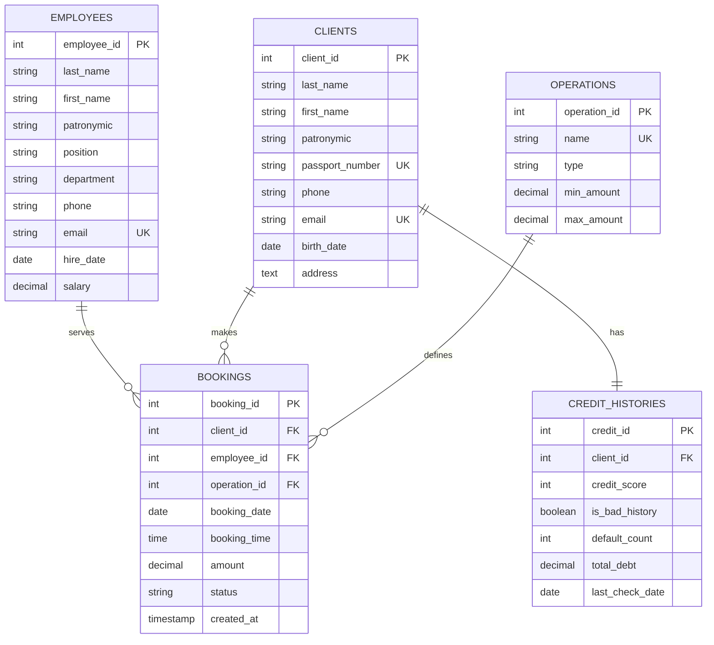

## Схема базы данных (ER-диаграмма)

```mermaid
erDiagram
    EMPLOYEES ||--o{ BOOKINGS : serves
    CLIENTS ||--o{ BOOKINGS : makes
    CLIENTS ||--|| CREDIT_HISTORIES : has
    OPERATIONS ||--o{ BOOKINGS : defines

    EMPLOYEES {
        int employee_id PK
        string last_name
        string first_name
        string patronymic
        string position
        string department
        string phone
        string email UK
        date hire_date
        decimal salary
    }

    CLIENTS {
        int client_id PK
        string last_name
        string first_name
        string patronymic
        string passport_number UK
        string phone
        string email UK
        date birth_date
        text address
    }

    CREDIT_HISTORIES {
        int credit_id PK
        int client_id FK
        int credit_score
        boolean is_bad_history
        int default_count
        decimal total_debt
        date last_check_date
    }

    OPERATIONS {
        int operation_id PK
        string name UK
        string type
        decimal min_amount
        decimal max_amount
    }

    BOOKINGS {
        int booking_id PK
        int client_id FK
        int employee_id FK
        int operation_id FK
        date booking_date
        time booking_time
        decimal amount
        string status
        timestamp created_at
    }
```
